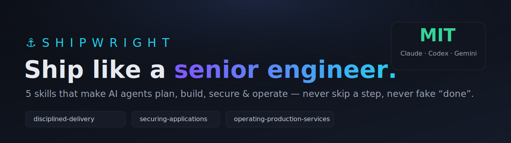
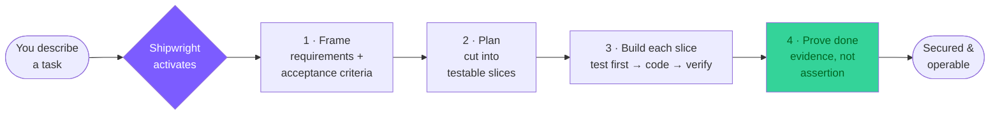

<div align="center">



# ⚓ Shipwright

### Production-grade engineering discipline for AI coding agents

**5 composable skills that make your AI agent plan, build, secure, and operate software like a senior engineer — never skipping a step, never faking "done".**

[](LICENSE)
[](#-the-five-skills)
[](https://claude.com/claude-code)
[](#-works-on-claude-code-codex--gemini)
[](CONTRIBUTING.md)

</div>

---

## ❓ Why Shipwright — the problem it solves

AI coding agents are fast, but undisciplined. Out of the box they:

| Without Shipwright ❌ | With Shipwright ✅ |
|---|---|
| Jump straight to code, no plan | **Plan first** — requirements → testable slices |
| Write code, then maybe a test | **Test each slice** before moving on |
| Say *"Done! ✅"* with no proof | **"Done" requires evidence** — the test output that proves it |
| Forget security until the breach | **OWASP Top 10:2025 gate** before shipping |
| Never think about staying alive in prod | **Day-2 controls** — rate limits, monitoring, backups, rollback |
| Bloat the context, burn tokens | **Token-frugal** — delegate, search-don't-read |

**The result without it:** work that *looks* finished and isn't. **Shipwright fixes the process, not just the prompt** — it installs the instincts a senior engineer carries, as skills your agent loads automatically when they matter.

> If your agent has ever confidently shipped something broken, this is the fix.

## ⚡ What you get

> Plan first → cut into testable slices → test every slice → **prove "done" with evidence** → ship it secure → keep it running.

A coherent suite covering the **whole lifecycle** — Build → Secure → Ship → Operate. Stack-agnostic, distilled from canonical 50k+ ⭐ engineering repos and **OWASP Top 10:2025**, written in neutral prose so it runs on **Claude Code, Codex, and Gemini CLI**.

## 🚀 Install (Claude Code)

```bash
claude plugin marketplace add nhattrung0911/shipwright
claude plugin install shipwright@shipwright
```

That's it — skills auto-activate by context. No config.

## 🔄 How it works



The engine (`disciplined-delivery`) runs this loop and pulls the other skills in as depth — security checks, ops gates, web pillars — exactly where each belongs.

## 📖 Usage guide (simple)

**You don't call the skills manually — you just work.** Describe what you want; the right skill fires on its own.

| You say… | Skill that fires | What it does |
|---|---|---|
| *"Build me a SaaS dashboard"* | `shipping-production-websites` + `disciplined-delivery` | Frames it, plans slices, walks 14 production pillars |
| *"Build a RAG chatbot"* | `disciplined-delivery` + `securing-applications` | Plan + test gates + prompt-injection / LLM checks |
| *"Is this secure before I ship?"* | `securing-applications` | OWASP Top 10:2025 gate with a runnable check per risk |
| *"How do we keep it running?"* | `operating-production-services` | Rate limits, monitoring, backups, rollback, DR |
| *"Refactor this large repo"* | `token-frugal-engineering` | Keeps context lean, delegates verbose work |

**Prefer to invoke one explicitly?**

```
/shipwright:disciplined-delivery
/shipwright:securing-applications
```

**That's the whole workflow:** install once → describe tasks normally → the agent now plans, tests, secures, and proves its work automatically.

## 🧭 The five skills

| Skill | What it enforces |
|---|---|
| **`disciplined-delivery`** | The engine. Frame → Plan → Slice → Verify for **any** project (web, LLM, ML, CLI, library, mobile, infra). Evidence-based "done", grader-≠-doer check. |
| **`shipping-production-websites`** | Web: 12-layer full-stack map + 14 production pillars + pre-launch gate. Frontend, API, DB, auth, payments, i18n, SEO, config. |
| **`securing-applications`** | OWASP Top 10:2025 → defense + a runnable check per risk. CSRF, SSRF, BOLA, JWT, file-upload, CORS, headers, **LLM prompt-injection**, data privacy. |
| **`operating-production-services`** | Day-2: rate limiting, retries, circuit breakers, SLO, on-call, canary deploys, **DR (RTO/RPO)**, backups + restore drills, cert rotation. |
| **`token-frugal-engineering`** | Keep the agent's context lean: delegate verbose work, search don't read, session hygiene. |

## 🔗 How they chain

```
disciplined-delivery            ← the engine, every non-trivial build
├─ shipping-production-websites  ← pulled in for web projects
├─ securing-applications         ← the security gate (OWASP Top 10:2025)
├─ operating-production-services ← runtime controls + Day-2 maintenance
└─ token-frugal-engineering      ← cross-cutting, keeps context cheap
```

Use one, use all — they cross-reference but each stands alone.

## ✨ What makes it different

- **Evidence over assertion.** "Done" requires the test output / eval score that proves it. Hedging words ("should work", "probably") are red flags the skill catches.
- **No step skipped.** Pressured to "just ship it"? The plan shrinks to 3 lines — it never disappears.
- **Grader ≠ doer.** A fresh check grades the work against criteria with a per-criterion `PASS/FAIL + evidence` table. Faking requires fabricating output.
- **Battle-tested sources.** Distilled from `system-design-primer`, `developer-roadmap`, `nodebestpractices`, `clean-code-javascript`, `awesome-scalability` (all 50k+ ⭐) and OWASP Top 10:2025.

## 🌐 Works on Claude Code, Codex & Gemini

Skill bodies use neutral prose, so they port across agents.

| Agent | How to install |
|---|---|
| **Claude Code** | `claude plugin marketplace add nhattrung0911/shipwright` → `claude plugin install shipwright@shipwright` |
| **Codex** | Copy the `skills/*` folders into `~/.agents/skills/` |
| **Gemini CLI** | Copy the `skills/*` folders into `~/.gemini/skills/` |

## 📚 Browse the skills

- [`skills/disciplined-delivery`](skills/disciplined-delivery/SKILL.md)
- [`skills/shipping-production-websites`](skills/shipping-production-websites/SKILL.md)
- [`skills/securing-applications`](skills/securing-applications/SKILL.md)
- [`skills/operating-production-services`](skills/operating-production-services/SKILL.md)
- [`skills/token-frugal-engineering`](skills/token-frugal-engineering/SKILL.md)

## 🤝 Contributing

PRs welcome — new skills, sharper checks, fixes. See [CONTRIBUTING.md](CONTRIBUTING.md). House rules: neutral/portable prose, evidence-based gates, lean bodies.

## ⭐ Like it?

If Shipwright makes your agent ship better, **star the repo** — it helps others find it.

## 📄 License

[MIT](LICENSE) — free for any use, personal or commercial.

---

<div align="center">
<sub>Build → Secure → Ship → Operate. Like a senior engineer.</sub>
</div>
