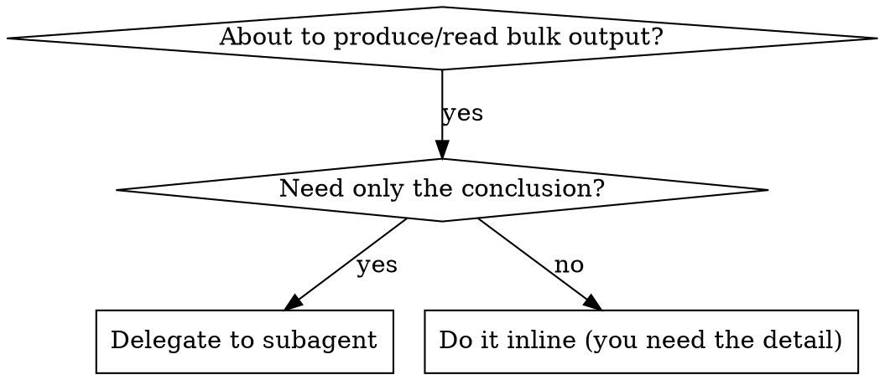

# Token-Frugal Engineering

## Overview

The expensive resource is **main-context tokens**, not wall-clock. Every file dumped, log scrolled, or option narrated burns budget you can't get back. This skill is the distilled discipline for spending tokens where they buy correctness and nowhere else.

**Core principle:** Keep verbose, low-signal work OUT of main context. Pull only the conclusion in.

**Announce at start (long/heavy tasks):** "Using token-frugal-engineering to keep context lean."

## The Essence Rules

| # | Rule | Why |
|---|---|---|
| 1 | **Delegate verbose work to subagents** — *when output is bulky AND you need only the verdict*: tests, builds, log scans, broad searches, doc fetches. Instruct the agent to return capped, structured output ("≤10 lines, failing names only"). | Raw output never lands in main context. Skip for a short log/tiny suite — agent overhead beats the savings there |
| 2 | **Search, don't read** — Grep/Glob to locate; never `cat`/`find`/whole-file reads to explore | A read pulls the whole file; a grep pulls 3 lines |
| 3 | **Scoped reads** — Read with offset/limit on the part you need | Don't load 2000 lines for one function |
| 4 | **Don't re-read to confirm a write landed** — Edit/Write already errors on failure; harness tracks state. *Legit verification reads (did the logic come out right after a tricky multi-edit) are fine.* | Confirm-reads are pure waste; correctness-reads are not |
| 5 | **Plan before code** on non-trivial tasks | Misdirected edits = wasted tokens + rework churn |
| 6 | **Batch independent tool calls** in one message (parallel) | Fewer round-trips, less restated context |
| 7 | **Deterministic > generative** — scripts/validators/generators for mechanical work | A regex/linter costs ~0 model tokens vs reasoning each case |
| 8 | **Reference skills by name, never `@`-load** | `@path` force-loads the whole file immediately, before you need it |
| 9 | **Progressive disclosure in skills** — thin SKILL.md, heavy detail in reference files loaded on demand | Always-loaded bytes tax every conversation |
| 10 | **Terse output** — answer, don't narrate options you won't pursue | Prose is tokens too |
| 11 | **Session hygiene** — between unrelated tasks, `/clear`; on a long thread, summarize-then-continue | Rules 1–10 stop *adding* tokens; this *removes* tokens already accumulated |

## Subagent Delegation (rule 1 — the biggest win)

Delegate when output is **verbose and you need only the verdict**:

- Running a test suite → "run tests, return pass/fail + failing names only"
- Scanning logs → "find the error + 5 lines context"
- Exploring an unknown codebase → use `Explore` agent, get the map not the dumps
- Fetching docs → return the one relevant snippet

**REQUIRED SUB-SKILL** for parallel/independent work: `superpowers:dispatching-parallel-agents`.

Keep in main context: the decision, the diff, the one file you're actively editing.

## Quick Decision

## Audit & Tune

- Context feels bloated? Run the `context-budget` skill to find what's eating tokens.
- Choosing response depth deliberately? `token-budget-advisor`.
- This skill = how to *work* frugally; those two = *measure* and *dial*.

## Companion skills

- Overall delivery engine that pulls this throughout a build → `disciplined-delivery`.
- Note: rules 8–9 (`@`-load, progressive disclosure) are Claude-Code-specific mechanics; the rest are platform-agnostic.

## Common Mistakes

| Mistake | Fix |
|---|---|
| `cat`-ing a file to "see what's there" | Grep for the symbol; scoped Read |
| Reading a file back after editing it | Edit/Write already confirmed; harness tracks state |
| Running the full test suite inline | Delegate; pull pass/fail summary |
| Narrating 3 approaches before picking | Recommend one, act |
| Fat always-on SKILL.md / CLAUDE.md | Move detail to on-demand reference files |
| Serial tool calls for independent reads | Batch them in one message |
